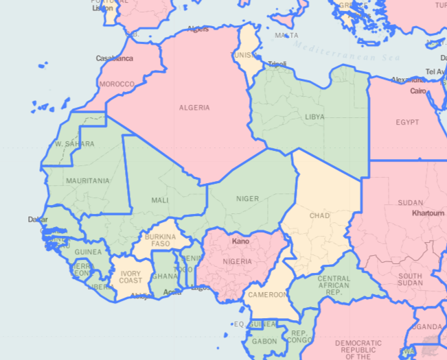
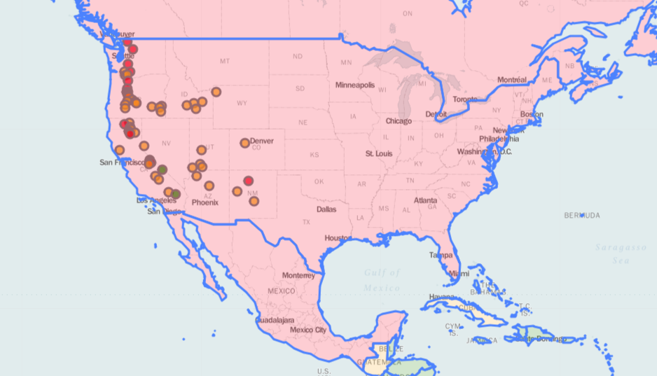

# Web Map

A `folium` based html plotter to add visualization data to a static world map. 

### Instructions

1. Clone the repository

> git clone https://github.com/onocy/web-map.git

2. Make sure you have [python 3 installed](https://www.python.org/downloads/mac-osx/)

2. Install the relevant libraries 

> pip install pandas
> pip install folium

3. Run the python file

> python web-map.py

4. Open the html file

> open Map1.html

---------------------------

